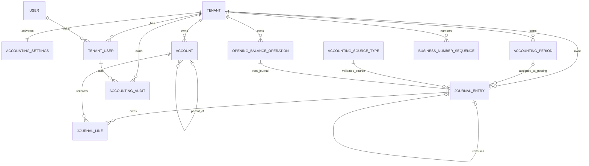

# Accounting Foundations v1 — Domain Model

Version: 1.0
Status: **FROZEN + DDL-READY**

## 1. Model intent

The model separates ledger truth, master data, control state, onboarding
workflow, and audit provenance. It does not model future subledgers.

```text
Ledger truth       = Posted JournalEntry + immutable JournalLines
Master data        = Account
Posting control    = AccountingSettings + AccountingPeriod
Onboarding control = OpeningBalanceOperation
Control provenance = AccountingAudit
Number state       = existing BusinessNumberSequence
```

No audit row, status projection, or cached total replaces Posted Journal Lines.

## 2. Entity relationship diagram



Actor columns on Accounting entities also reference same-Tenant
`TENANT_USER(tenant_id,user_id)`. They are not all drawn above to keep the ERD
readable.

## 3. Entity catalog

### 3.1 AccountingSettings

One row per activated Tenant. It freezes the SAR ledger policy and provides the
coordination row for rare Tenant-wide Accounting metadata operations. Presence
means Accounting is active; no `disabled` state is invented.

### 3.2 Account

A Tenant-owned Chart-of-Accounts node. `kind=group` organizes children and can
never receive a Journal Line. `kind=posting` has a reporting classification and
can receive ordinary postings while active.

### 3.3 AccountingPeriod

An inclusive, non-overlapping Tenant date range with current state `open` or
`closed`. Gaps are allowed. A Posted Journal permanently stores its resolved
Period ID.

### 3.4 JournalEntry

The ledger aggregate root. A Draft is editable and unnumbered. Posting is one
terminal transition that validates the complete aggregate, assigns its Period
and number, and makes both header and Lines immutable.

### 3.5 JournalLine

An owned Journal child with a contiguous line number, one same-Tenant posting
Account, exact debit and credit amounts, and an optional memo. Lines have no
independent lifecycle.

### 3.6 OpeningBalanceOperation

An auditable initial-onboarding workflow owning one opening-balance Journal. Its
workflow status remains `posted` after correction; a separate effect projection
tracks whether the linear exact-reversal chain currently makes the operation
`effective` or `neutralized`.

### 3.7 AccountingAudit

Append-only control evidence for Accounting actions. It stores a stable event,
subject identity, actor, timestamp, and small structured context. It does not
repeat Journal Lines.

### 3.8 AccountingSourceType

An immutable, migration-owned global catalog of allowed non-manual source keys.
It prevents controller names, class names, URLs, arbitrary user strings, and
unregistered module events from becoming persisted provenance.

### 3.9 BusinessNumberSequence

Existing shared Core infrastructure. Accounting owns neither its schema nor a
second counter table. It consumes the `JRN` prefix scoped by Tenant and
`entry_date` year.

## 4. Aggregate relationships and deletion

| From | To | Rule | Delete behavior |
|---|---|---|---|
| Account | parent Account | Same Tenant, same account type, parent kind `group` | Parent `RESTRICT` while children exist |
| JournalEntry | AccountingPeriod | Null in Draft; mandatory and same Tenant when Posted | Period `RESTRICT` forever once referenced |
| JournalLine | JournalEntry | Same Tenant; child of aggregate | Draft Journal deletion explicitly deletes/cascades Draft Lines; Posted parent deletion is trigger-forbidden |
| JournalLine | Account | Same Tenant; Account kind/status validated at posting | Account `RESTRICT` once referenced |
| reversal Journal | target Journal | Same Tenant, target Posted, exact opposite, one direct child | Target `RESTRICT`; both Journals immutable |
| JournalEntry | source-type catalog | Required for every non-manual origin | Catalog row `RESTRICT` and immutable |
| OpeningBalanceOperation | root Journal | Same Tenant, opening source points back to Operation | Both retained permanently once Posted |
| Accounting actors | TenantUser | Same Tenant membership evidence | Membership/User physical deletion `RESTRICT` |
| AccountingAudit | subject | Stable typed ID plus trigger-validated Tenant ownership at audit insertion | All prior audit rows survive only the explicitly permitted deletion of a Draft subject and retain its former ID |

There is no physical delete for Accounts, Posted Journals, Posted Lines,
AccountingSettings, or Posted OpeningBalanceOperations. Period deletion is also
absent in v1. Only Draft Journal aggregates and Draft OpeningBalanceOperations
may be physically deleted through their explicit use cases.

## 5. State transition tables

### 5.1 Account

| From | Action | To | Preconditions | Forbidden | Audit | DB protection |
|---|---|---|---|---|---|---|
| none | create | active | Accounting active; unique code; valid parent/type/kind/classification; active actor | create archived; cross-Tenant parent; cycle | `account.created` | CHECK, UNIQUE, composite FKs, hierarchy trigger |
| active | edit descriptive fields | active | Locked Account; nonblank result | edit while archived | `account.updated` with changed field names | row lock, CHECK |
| active | structural edit | active | Locked coordination row and Account/subtree; no Posted History in moved/changed subtree; valid hierarchy | any history-affecting structural rewrite | `account.updated` with before/after structure | lifecycle/history/hierarchy triggers |
| active | archive | archived | Account locked; if group, no active descendant; not a required future control reference | archive already archived; new ordinary posting race | `account.archived` | lifecycle CHECK/trigger and shared Account row lock with posting |
| archived | restore | active | Account locked; every ancestor active; code still reserved by same row | restore under archived ancestor | `account.restored` | lifecycle CHECK/trigger |
| any | delete | — | none | all Account deletion | none | immutable/delete trigger plus FKs |

Account archive does not erase or reclassify Posted History. Exact reversal may
use an archived posting Account because it can only reproduce the target Lines.

### 5.2 JournalEntry

| From | Action | To | Preconditions | Forbidden | Audit | DB protection |
|---|---|---|---|---|---|---|
| none | create manual Draft | draft | Accounting active; active authorized actor; valid header shape | insert as Posted | `journal.draft_created` | insert/status trigger |
| draft | edit header/Lines | draft | Actor authorized; parent Journal locked; origin-specific endpoint; valid row-level fields | edit a non-manual Draft through manual endpoint | no durable event required for each keystroke | parent-state triggers and CHECKs |
| draft | delete | — | Manual Draft, or Draft Opening operation through its owner; parent locked | delete Posted | manual: `journal.draft_deleted`; opening: `opening_balance.draft_deleted` | parent trigger; aggregate delete ordering |
| draft | post | posted | Complete invariant set: source, period, accounts, lines, exact balance, number, actor, locks, audit | unbalanced, closed/no Period, inactive/group/cross-Tenant Account, duplicate source, direct Posted insert | `journal.posted` | posting trigger, constraints, partial UNIQUEs |
| posted | reverse | posted | Target locked; exact opposite new Journal; eligible reversal date/Period; no existing direct reversal | mutate target; partial reversal; second direct reversal | `journal.reversed` plus posting audit for new Journal | immutable triggers, unique reversal FK, exactness trigger |
| posted | update/delete | — | none | every direct mutation | none | immutable header/child triggers |

`reverse` does not transition the target out of `posted`; it creates another
Posted Journal. There is no physical `reversed` Journal status.

### 5.3 AccountingPeriod

| From | Action | To | Preconditions | Forbidden | Audit | DB protection |
|---|---|---|---|---|---|---|
| none | create | open | Accounting active; valid inclusive range; no overlap | create closed; overlapping range | `period.created` | CHECK, composite FK, serialized overlap trigger |
| open | edit boundaries | open | Coordination and Period locks; no Posted Journal assigned; resulting ranges do not overlap | edit after Posted History; make start > end | `period.boundaries_changed` | history/overlap trigger |
| open | close | closed | Period lock; authorized actor | close twice; race a posting into it | `period.closed` | state trigger; same Period row lock as posting |
| closed | reopen | open | Period lock; administrator; nonblank reason | reopen without reason/actor | `period.reopened` | lifecycle CHECK/trigger |
| any | delete | — | none in v1 | all Period deletion | none | delete trigger and FKs |

Draft Journals do not block closing. They remain Draft and cannot post unless
their `entry_date` later resolves to an open Period.

### 5.4 OpeningBalanceOperation

State is the pair `(status,effect_state)`.

| From | Action | To | Preconditions | Forbidden | Audit | DB protection |
|---|---|---|---|---|---|---|
| none | create | draft / null | Accounting active; Settings coordination lock; no other Draft/effective operation; date not before prior neutralization floor | second slot occupant; backdated overlap | `opening_balance.created` | partial UNIQUE slot, source/ownership/date-floor triggers |
| draft / null | edit Journal | draft / null | Operation and Draft Journal locked | generic manual endpoint; non-opening source | no audit per line edit | owner/source triggers |
| draft / null | delete | — | Operation and owned Journal still Draft | delete Posted operation | `opening_balance.draft_deleted` | owner/status trigger |
| draft / null | post | posted / effective | Common posting invariants; source/date links match; no other slot occupant | status-only post without real Journal | `opening_balance.posted` | partial UNIQUE plus deferred cross-table constraint trigger |
| posted / effective | reverse terminal chain Journal | posted / neutralized | Exact reversal posts in open Period; settings/target/operation locked | change original amount/date/status | `opening_balance.reversed` | exact reversal plus deferred effect projection validation |
| posted / neutralized | reverse terminal reversal | posted / effective | No Draft or other effective operation; exact reversal; Settings lock; date meets prior neutralization floor | create two effective or historically overlapping operations | `opening_balance.reactivated` | partial UNIQUE plus deferred projection/date-floor validation |
| posted / any | edit/delete | — | none | every mutation except validated effect projection advance | none | immutability trigger |

The latest chain Journal and parity are stored as a validated projection. The
root Journal and every reversal remain immutable ledger truth.

### 5.5 AccountingSettings

| From | Action | To | Preconditions | Forbidden | Audit | DB protection |
|---|---|---|---|---|---|---|
| none | activate | present/active | Tenant row locked; Tenant active; `tenants.currency='SAR'`; active administrator membership | duplicate activation; non-SAR activation | `accounting.activated` | one-per-Tenant UNIQUE, SAR CHECK, actor composite FK |
| present | update/deactivate/delete | — | none in v1 | every change or removal | none | immutable triggers |

Future approved modules may add explicit control-Account references through
forward migrations. No magic code lookup is part of Settings.

## 6. Immutability matrix

Legend: **Yes** = allowed through a named use case; **No** = forbidden;
**Conditional** = only the rule in the cell permits it; **N/A** = state does not
apply.

| Entity | While Draft | After Posted | While Archived | In Closed Period | With Existing Posted History |
|---|---|---|---|---|---|
| Account | N/A | N/A | restore only; no descriptive/structural edit | Account lifecycle independent of Period state | name/description and archive/restore allowed; code/type/classification/kind/parent frozen for affected history subtree |
| JournalEntry | header and owned Lines editable; Draft deletable | no update/delete; exact reversal creates new Journal | N/A | existing Posted remains readable; no new posting dated into Period | immutable forever |
| JournalLine | insert/update/delete only under locked Draft parent | no insert/update/delete | Account may later archive without changing Line | immutable and reportable | immutable forever |
| AccountingPeriod | N/A | N/A | N/A | state metadata changes only through reopen | boundaries frozen when any Posted Journal references Period |
| OpeningBalanceOperation | owned opening Journal editable; operation deletable | core fields immutable; validated effect projection may advance on exact reversal | N/A | reversal must use a different open Period/date if necessary | root values immutable; replacement is a new operation after neutralization |
| AccountingSettings | no Draft state | N/A | N/A | independent of Period state | entire v1 row immutable after activation |
| AccountingAudit | N/A | append-only from insertion | N/A | remains append-only | immutable forever |

## 7. Historical truth rules

1. A Posted Journal's ID, Tenant, origin, source tuple, entry date, Period,
   description, number, actors, timestamps, reversal target, and Lines never
   change.
2. Account renaming is audited and intentionally changes the current label used
   by reports; it does not change the Account ID/code or any amount. Account
   names are master-data labels, not snapshotted into each Line.
3. Account code/type/classification/kind/parent cannot change once the Account or
   affected descendant subtree has Posted History.
4. Period reopen changes current control state; it does not rewrite the Period
   stored on earlier Journals or their original posting timestamps.
5. A reversal does not mark or rewrite the target. Its exact opposite Lines make
   the correction visible through the same ledger query path.
6. Opening-balance `effect_state` is a current control projection only. The root
   Journal and reversal chain determine economic truth and validate the
   projection.
7. Audit provides who/why/control context. It is not used to calculate money.

Business and reversal Journals may occupy `draft` only inside the transaction
that posts them. A deferred final-state guard rejects a commit that would leave
either origin as Draft. Persistent Draft state is limited to manual Journals and
OpeningBalanceOperation-owned Journals.

## 8. Tenant ownership rule

For every relationship between tenant-owned Accounting records:

```text
child(tenant_id, parent_id)
    → parent(tenant_id, id)
```

The referenced parent exposes `UNIQUE (tenant_id,id)`. A separate direct Tenant
FK is retained. Application queries also scope by Tenant, but query scoping is
not the integrity guarantee.

Actors use:

```text
(tenant_id, actor_user_id)
    → tenant_users(tenant_id, user_id)
```

Application code additionally requires active membership and active User state
at command time.

## 9. Model exclusions

There is no entity in v1 for:

- Ledger Balance or Account Balance;
- debit/credit transaction type separate from Journal Lines;
- currency, exchange rate, or foreign amount per Line;
- generic dimension or cost-center allocation;
- approval state;
- physical Journal reversal state;
- financial document/subledger;
- fiscal-year aggregate;
- stored report totals.

These omissions are intentional, not unresolved gaps.
